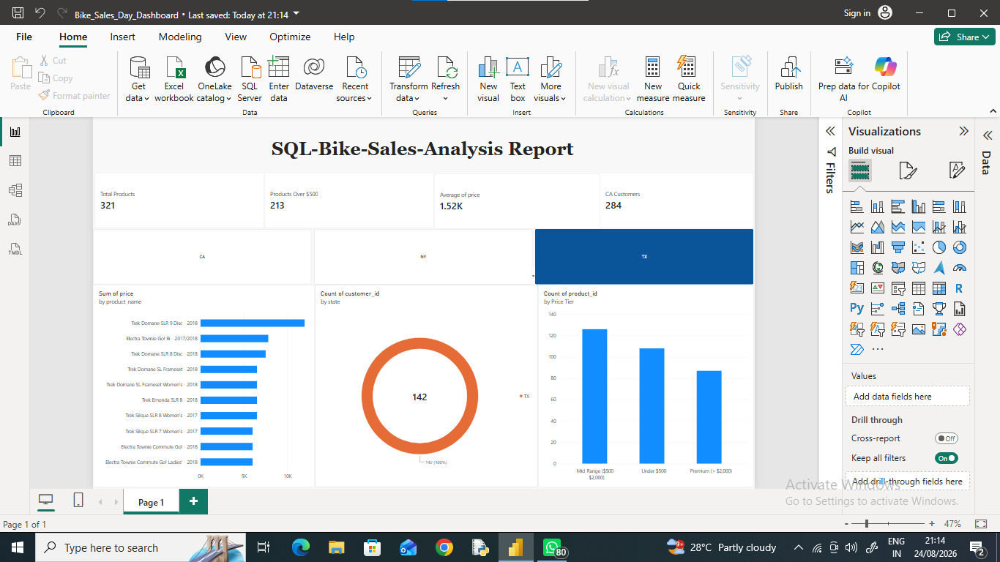

# Bike Store SQL Analysis

This repository contains SQL queries and schema scripts for analyzing bike store sales data, customer demographics, and product catalog pricing.

## Project Structure
- `data/`: Raw CSV datasets (Products, Customers, Orders).
- `scripts/`: SQL scripts for table creation and analysis.

## Day 1: Basic Retrieval & Filtering
1. **Product Pricing**: Retrieved product names and unit prices from the catalog.
2. **Geographic Filtering**: Extracted all customer records located in California (`CA`).
3. **Price Filtering**: Filtered premium bikes and frames priced over $500.

## Day 2: Relational Joins & Revenue Performance
1. **Customer Purchase Mapping (3-Table Join)**: Linked individual order transactions to customer identities and product specifications.
2. **Top 5 Revenue Drivers**:
3. **Customer Order Frequency (Top Buyers)**:

## 📊 Day 1 Executive Dashboard (Power BI)

- `.pbix` file available in the `/dashboard` directory.

## Repository Structure
sql-bike-sales-analysis/
├── data/
│   ├── Customers.csv
│   ├── Orders.csv
│   └── Products.csv
├── scripts/
│   ├── 01_schema_setup.sql
│   ├── 02_day1_basic_queries.sql
│   └── 03_day2_joins_and_aggregations.sql
├── dashboard/
│   ├── Bike_Sales_Analysis.pbix
│   ├── day1_dashboard_preview.png
│   └── day2_dashboard_preview.png
└── README.md